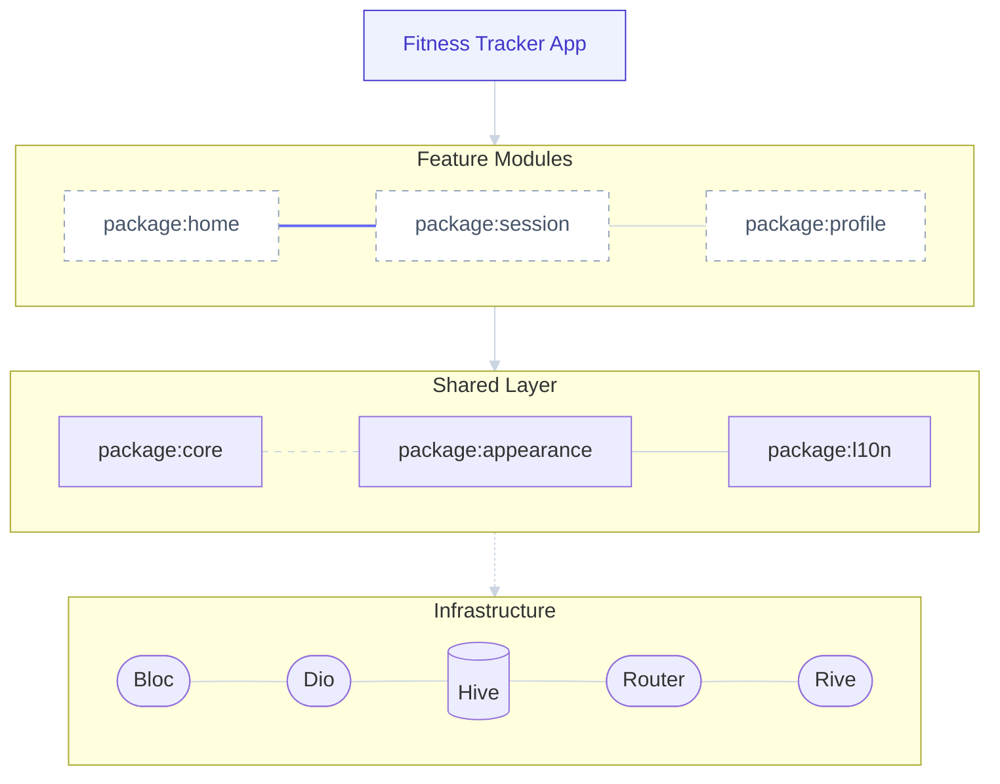

# Fitness Tracker

![coverage][coverage_badge]
[![style: very good analysis][very_good_analysis_badge]][very_good_analysis_link]
[![License: MIT][license_badge]][license_link]
[![GitHub stars][stars_badge]][repository_link]

## Contents
1. [Overview](#overview)
2. [Features](#features)
3. [Platform Availability](#platform-availability)
4. [Preview](#preview)
5. [Technologies](#technologies)
6. [Architecture](#architecture)

## Overview
This project serves as a production-ready blueprint for a modular Flutter application. While the UI focuses on fitness tracking essentials, the core objective was to engineer a highly decoupled, multi-package architecture capable of scaling to dozens of features without increasing technical debt.

It demonstrates professional-grade standards including:

- Strict Domain Separation: Zero-dependency feature modules.

- Design System Integration: A centralized, token-based appearance package.

- Resilient State Management: Predictable flows using BLoC with centralized dependency orchestration.

- Enterprise Tooling: 100% adherence to very_good_analysis and automated CI-ready structure.

## Features
### Home
- **Daily Challenges**: Gamified tasks to keep users motivated.
- **Workout Schedule**: Easy-to-view timeline of planned activities.
- **Social Feed**: Connect with friends and share progress.

### Session
- **Workout Library**: Browse available workout sessions.
- **Active Tracking**: Real-time monitoring of current exercises.

### Profile
- **Activity Metrics**: Visual breakdown of workout history and stats.
- **User Management**: Personal details and preferences.

### Platform Availability
| Platform | Readiness | Version |
| :--- | :--- | :--- |
| **Android** | **[ RELEASED ]** | v0.0.1 |
| **iOS** | **[ PLANNED ]** | -- |
| **Web** | **[ PLANNED ]** | -- |
| **Windows** | **[ PLANNED ]** | -- |
| **Linux** | **[ PLANNED ]** | -- |

## Preview

## Technologies
| Category | Tools |
| :--- | :--- |
| **Framework** | `flutter`, `dart` |
| **State Management** | `bloc`, `flutter_bloc` |
| **Navigation** | `go_router` |
| **Local Database** | `hive`, `hive_flutter` |
| **Animations** | `rive` |
| **Quality Control** | `very_good_analysis` |

## Architecture



### Modular Strategy
Instead of a standard monolithic "lib" folder, this project uses a **Multi-Package Monorepo** approach. This ensures strict boundaries between features, simplifies testing, and improves build times.

### Multi-Package Structure
- **Core Package (`packages/core`)**: The backbone of the app. It acts as a **Single Source of Truth** for strict dependencies (Bloc, Dio, Hive, GoRouter) using Barrel files (`export`). It also contains shared entities and utilities.
- **Appearance Package (`packages/appearance`)**: A dedicated Design System module. It houses all atomic design tokens (Colors, Typography, Spacing) and assets (Rive animations). It exposes `context` extensions for type safe UI development.
- **Feature Modules (`packages/home`, `profile`, etc.)**: Encapsulated business logic and UI. Features are horizontal slices that never depend on each other directly, only on the Core or Shared UI kit.

### Key Technical Decisions
| Decision | Rationale |
| :--- | :--- |
| **GoRouter & ShellRoute** | Implements persistent bottom navigation (keeping tabs alive) while allowing deep linking and nested routes properly. |
| **Flutter Bloc & Cubit** | Provides predictable state management. The `Core` package enforces a single version of Bloc across the app to avoid conflicts. |
| **Atomic Design via Code** | The `Appearance` package forces usage of defined tokens (e.g. `context.colors.primary`), bridging the gap between design and development. |
| **Strict Linting** | Uses `very_good_analysis` for high code quality and strict typing rules. |
| **Barrel Files** | Reduces import clutter. Importing `package:core/core.dart` gives access to all necessary third-party and shared tools. |

### Engineering Challenges
| Challenge | Solution |
| :--- | :--- |
| **Dependency Hell** | Centralized exports in `core` package, ensuring version consistency across all modules. |
| **Code Readability** | Implemented **Context Extensions** for the Design System, allowing `context.layout.button` syntax. |
| **Navigation State** | Utilized `StatefulShellRoute` to preserve the state of complex flows within each tab. |


## Getting Started

### Prerequisites
Ensure you have the following installed:
- **Flutter SDK**: `^3.38.9`
- **Dart SDK**: `^3.10.8`
- **Melos**: FLutter/Dart package manager for monorepos.
  ```bash
  dart pub global activate melos
  ```

### Installation
1. **Clone the repository**
   ```bash
   git clone https://github.com/dinmukhamednurkaliyev/fitness_tracker.git
   cd fitness_tracker
   ```

2. **Bootstrap the project**
   Initialize the workspace and link packages:
   ```bash
   melos bootstrap
   ```

3. **Run the App**
   The entry point is in the root `lib` folder (often linking to `packages` implicitly via `main.dart`).
   ```bash
   flutter run
   ```

[coverage_badge]: coverage_badge.svg
[license_badge]: https://img.shields.io/badge/license-MIT-blue.svg
[license_link]: https://opensource.org/licenses/MIT
[very_good_analysis_badge]: https://img.shields.io/badge/style-very_good_analysis-B22C89.svg
[very_good_analysis_link]: https://pub.dev/packages/very_good_analysis
[repository_link]: https://github.com/dinmukhamednurkaliyev/fitness_tracker
[stars_badge]: https://img.shields.io/github/stars/dinmukhamednurkaliyev/fitness_tracker?style=social
